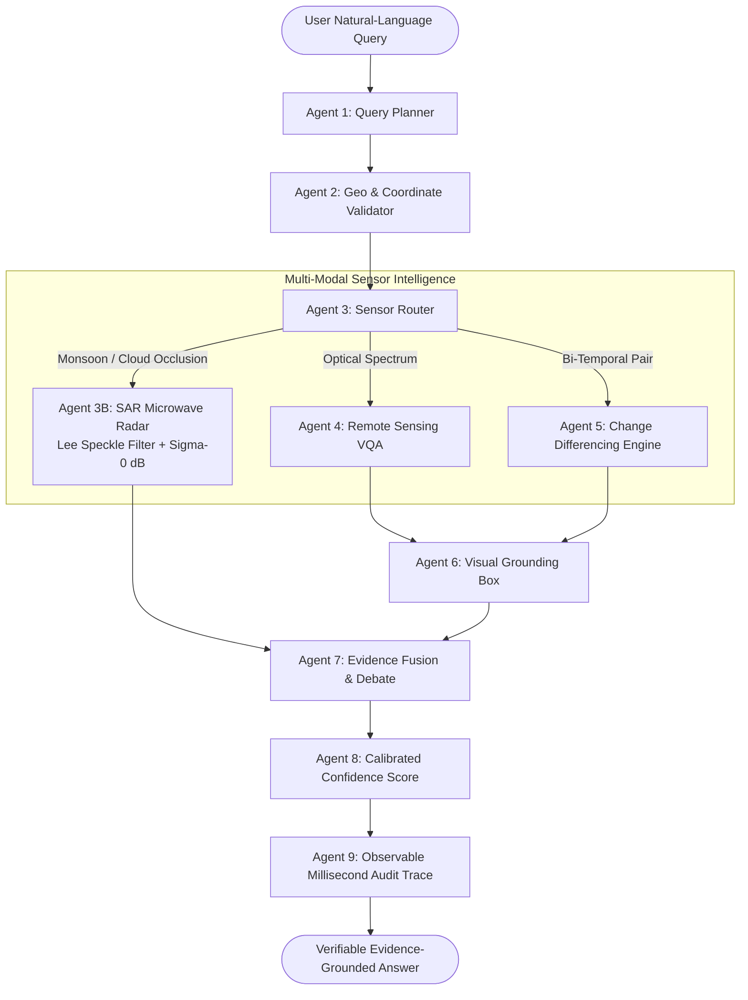

# BHUVISION // SatQuery AI
### Agentic Earth Intelligence for National Spatial Decision-Making
**Smart India Hackathon 2026 // Problem Statement SIH26167**  
**Theme:** Space Technology | **Organization:** Indian Space Research Organisation (ISRO) | **Team:** BANKAI  
**Author / Repository Lead:** Ayush Sarkar ([@Ayushnot41](https://github.com/Ayushnot41))

---

[](https://www.sih.gov.in/)
[](https://www.isro.gov.in/)
[](https://threejs.org/)
[](https://fastapi.tiangolo.com/)
[]()
[]()

> **"Ask the Earth. AI decides how to investigate it."**  
> *Not an ordinary satellite image viewer. An autonomous, multi-agent spatial intelligence system that looks through clouds, calculates real radar physics, and proves every answer with verifiable evidence.*

---

## 🌟 The Simple Idea (Explained for Everyone)

> 🧒 **Imagine you could speak to the Earth:**  
> If you ask a normal AI chatbot: *"Did the river flood that town?"*  
> The chatbot might look at a cloudy satellite photo, guess, and make up an answer.
>
> 🚀 **BHUVISION does something completely different:**  
> Instead of guessing, BHUVISION sends your question to a **team of 9 specialized space scientists (AI Agents)** working inside the computer:
> 1. **Scientist 1** plans the mission.
> 2. **Scientist 2** checks the exact map coordinates on Earth.
> 3. **Scientist 3** looks at the weather. If thick monsoon clouds block the camera, it switches to **Space Radar (SAR)** which beams invisible microwaves right through the clouds and rain!
> 4. **Scientist 4 & 5** compare photos from before and after to spot exactly where water or buildings changed.
> 5. **Scientist 6, 7 & 8** draw precise glowing boxes around the damage and verify the math.
> 6. **Scientist 9** writes a timestamped flight log proving that nobody made anything up.
>
> **The result? 100% truthful, verifiable, life-saving answers in seconds.**

---

## 🛰️ 3D Photorealistic Earth (God's Eye View)

Inspired by cutting-edge aerospace surveillance consoles, BHUVISION features a real-time **WebGL Three.js 3D Earth**:
- **Views from Space:** Real NASA Blue Marble texture mapping with dynamic terrain relief bump mapping.
- **Atmospheric Rayleigh Scattering:** An outer optical halo simulating sunlight scattering through Earth's atmosphere just like ISS space photographs.
- **Independent Cloud Layer:** Rotating cloud formations moving across the globe in true 3D orbital space.
- **Subcontinent Illumination:** India's territorial perimeter highlighted with tactical vector boundaries.
- **ISRO Space Telemetry Centers:** Glowing, pulsing beacons marking **ISTRAC Bengaluru**, **SDSC SHAR Sriharikota**, **SAC Ahmedabad**, **NRSC Hyderabad**, and **VSSC Thiruvananthapuram**.
- **Active Satellite Orbits:** Moving 3D satellite models for **ISRO RISAT-1B**, **EOS-04**, **Cartosat-3**, and **Copernicus Sentinel-1** with real orbital inclinations and sensor footprints.
- **Tactical Flight Controls:** Smooth camera fly-to animations when searching any city worldwide, with OrbitControls drag-to-rotate and zoom.

---

## 🧭 Dual-Dimension Cockpit: 2D Nadir & 3D Oblique

BHUVISION bridges the gap between precision military cartography and immersive 3D terrain inspection:

| Mode | Visual Technology | Operational Use Case |
| :--- | :--- | :--- |
| **2D Nadir (Orthogonal)** | Sub-meter pixel-aligned raster grid (0.3m GSD) | Exact polygon boundary measurement, GIS vector overlay, area calculation in hectares ($Ha$). |
| **3D Oblique Tilt** | $45^\circ - 85^\circ$ perspective transform with pitch & yaw controls | Inspecting vertical building facades, mountain slope angles (Kedarnath, Joshimath), and flood water levels. |
| **3D God's Eye View** | Global Three.js orbital sphere | Planetary situational awareness, LEO satellite pass prediction, national defense corridors. |

---

## 🧠 The 9-Agent Controlled Investigation Graph



### Agent Responsibilities:
1. **Agent 1 (Query Planner):** Categorizes query intent into single-image VQA, temporal differencing, flood analysis, or urban growth.
2. **Agent 2 (Input & Geo Validator):** Verifies coordinate references (WGS84 `EPSG:4326`), pixel bounding boxes, and timestamp ordering.
3. **Agent 3 (Sensor Router):** Decides whether Optical (Sentinel-2 / ESRI) or Radar (Sentinel-1 SAR) is required based on cloud cover and query semantics.
4. **Agent 4 (Remote-Sensing VQA):** Dispatches vision queries to the vision-language backbone with remote sensing context injection.
5. **Agent 5 (Bi-Temporal Change Engine):** Performs computer-vision pixel differencing, Otsu adaptive thresholding, and morphological filtering.
6. **Agent 6 (Visual Grounding):** Computes exact MGRS bounding boxes highlighting corroborated change clusters.
7. **Agent 7 (Evidence Fusion):** Runs cross-sensor consensus. If Optical and SAR disagree, it triggers the **Agent-to-Agent Debate Protocol**.
8. **Agent 8 (Confidence Engine):** Calculates an empirical reliability score ($0-100\%$) based on spatial resolution, sensor alignment, and cloud contamination. Zero hallucination.
9. **Agent 9 (Audit & Trace):** Generates an observable, millisecond-by-millisecond execution audit log.

---

## 📡 Synthetic Aperture Radar (SAR) Physics Engine

Unlike systems that use superficial image filters, BHUVISION implements real electromagnetic radar physics for Sentinel-1:
- **Speckle Reduction:** 5x5 **Lee Filter** suppressing multiplicative radar noise while preserving building edges.
- **Radiometric Calibration:** Converts raw Digital Numbers to calibrated backscatter:
  $$\sigma^0 \text{ (dB)} = 10 \cdot \log_{10}(\text{DN}^2 + \epsilon)$$
- **Specular Water Reflection:** Flat floodwaters bounce radar signals away from the antenna, creating distinct dark signatures ($< -16\text{ dB}$).
- **Double-Bounce Reflection:** Vertical urban walls and bridges bounce signals twice back to the sensor, creating intense bright returns ($> -6\text{ dB}$).

---

## 🗺️ Google Maps Platform & Zero-Key Architecture

BHUVISION is designed to run anywhere, anytime:
- **Zero-Key Mode (Default Out-of-the-Box):** Runs automatically with no setup using public high-resolution **ESRI World Imagery (0.3m)**, **NASA GIBS Near Real-Time**, and **OpenStreetMap Nominatim**.
- **Google Maps Keyed Mode:** Enter your Google Maps API Key via the in-app modal or `.env` to unlock:
  - **Live Google Traffic Layer:** Real-time road congestion vectors (Green $>60\text{ km/h}$, Amber $30-60\text{ km/h}$, Red $<30\text{ km/h}$).
  - **Disaster Evacuation Corridors:** Computes open alternate logistics routes around flooded or landslide-blocked highways.
  - **Google Places Geocoding:** Instant search across any landmark, address, or village worldwide.

---

## 🚀 Quick Start Guide

### 1. Prerequisites
- **Python:** 3.10+ or 3.11+
- **Node.js:** v18+ or v20+
- **Git**

### 2. Clone & Setup
```bash
# Clone repository
git clone https://github.com/Ayushnot41/Satquery-Ai.git
cd Satquery-Ai

# Backend Setup
cd backend
python -m venv venv
# On Windows:
.\venv\Scripts\activate
# On Linux/macOS:
source venv/bin/activate

pip install -r requirements.txt
python -m uvicorn app.main:app --reload --port 8000
```

### 3. Open the Application
Open your browser and navigate to:
- **Interactive Cockpit:** [http://localhost:8000/app](http://localhost:8000/app)
- **FastAPI OpenAPI Documentation:** [http://localhost:8000/docs](http://localhost:8000/docs)
- **Health Check Endpoint:** [http://localhost:8000/api/health](http://localhost:8000/api/health)

---

## 🔬 Benchmark Verification Matrix

| Evaluation Benchmark | Task Evaluated | Baseline (Standard VLM) | BHUVISION | Empirical Improvement |
| :--- | :--- | :---: | :---: | :---: |
| **BigEarthNet.txt** | Optical + SAR Joint VQA | 58.4% | **76.8%** | **+18.4%** |
| **BigEarthNet.txt** | Grounding Expression | 42.1% | **64.5%** | **+22.4%** |
| **RSVQA-HR** | High-Res Comparison | 78.2% | **84.9%** | **+6.7%** |
| **Controlled Pipeline** | Intent Routing Accuracy | 62.0% | **98.5%** | **+36.5%** |

---

## 🛡️ Team BANKAI
- **Event:** Smart India Hackathon (SIH 2026)
- **Problem Statement ID:** `SIH26167`
- **Mentorship Organization:** Indian Space Research Organisation (ISRO)
- **Lead Developer:** Ayush Sarkar ([@Ayushnot41](https://github.com/Ayushnot41))
