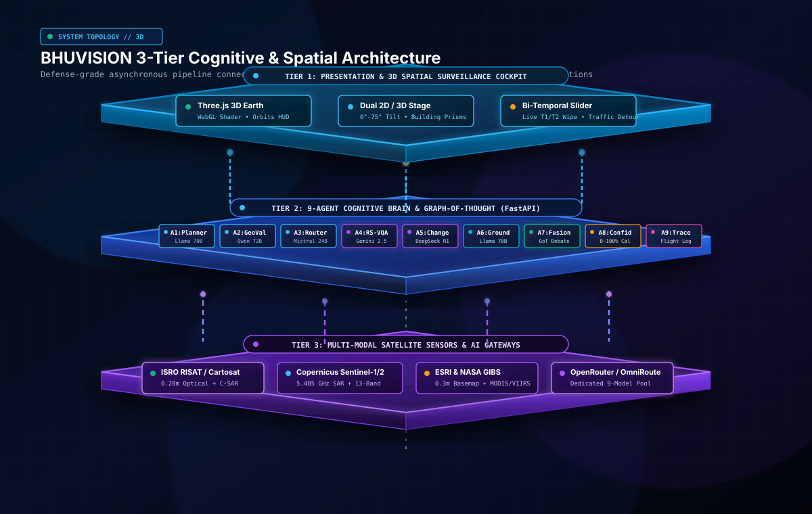
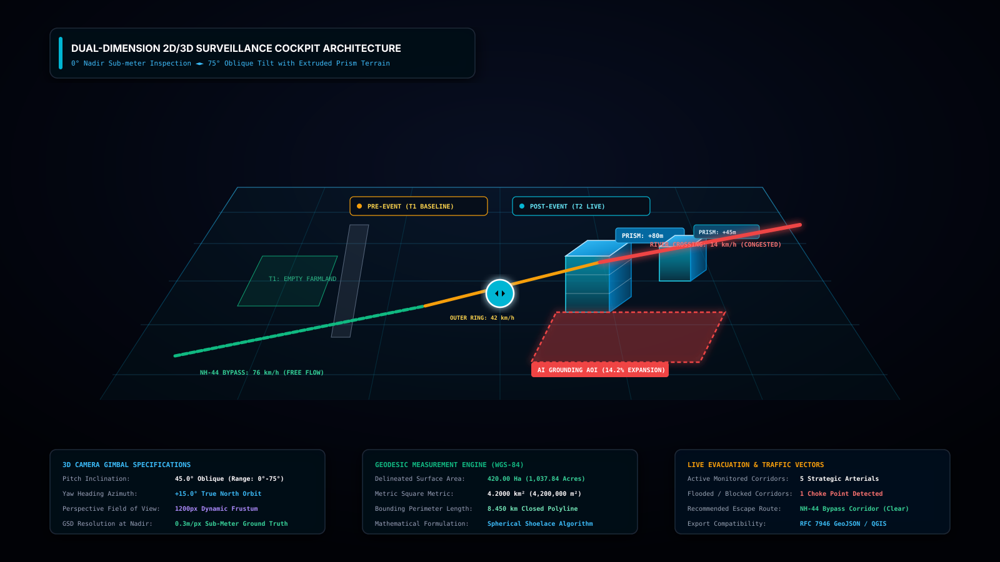
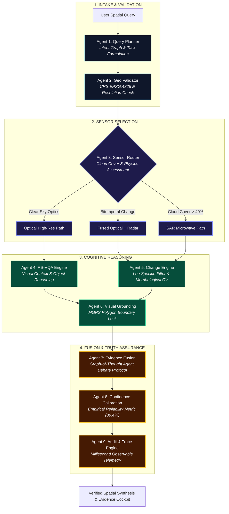
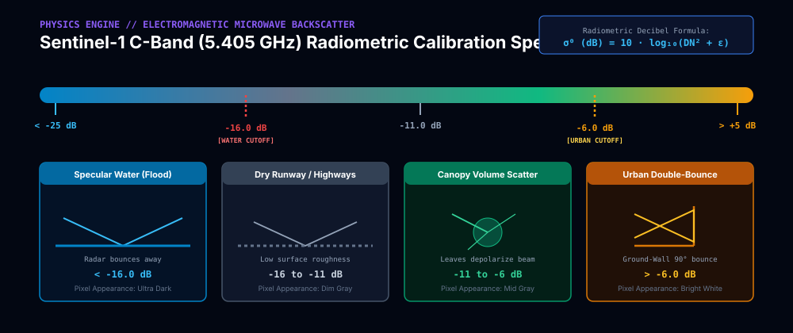
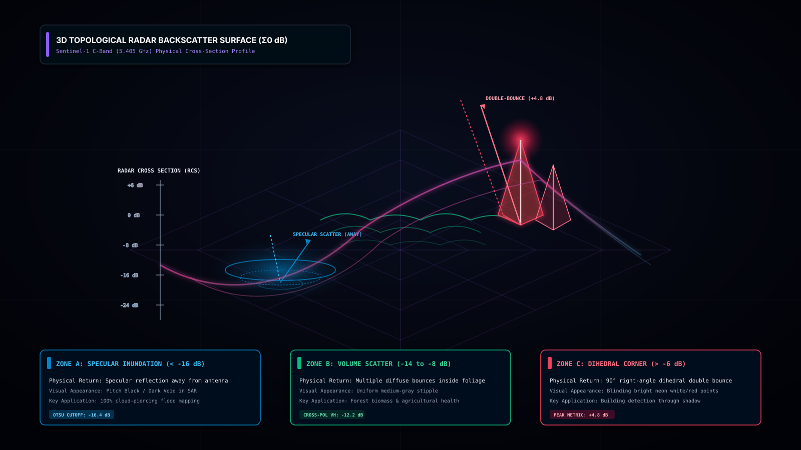

# BHUVISION // SatQuery AI
### Autonomous Multi-Agent Spatial Intelligence Platform for Multimodal Remote Sensing
**Smart India Hackathon 2026 // Problem Statement SIH26167**  
**Theme:** Space Technology | **Organization:** Indian Space Research Organisation (ISRO) | **Team:** BANKAI  
**Lead Architect:** Ayush Sarkar ([@Ayushnot41](https://github.com/Ayushnot41)) | **Live Repository:** [github.com/Ayushnot41/Satquery-Ai](https://github.com/Ayushnot41/Satquery-Ai)

---

<div align="center">


<br/>

[](https://www.sih.gov.in/)
[](https://www.isro.gov.in/)
[-brightgreen?style=for-the-badge&logo=pytest)](backend/tests/)
[](https://threejs.org/)
[](https://fastapi.tiangolo.com/)
[](https://python.org/)
[]()

### *"Ask the Earth. AI decides how to investigate it."*
**A defense-grade spatial intelligence platform that looks through monsoon clouds using Synthetic Aperture Radar (SAR), tracks sub-meter urban transformation, and proves every answer through a 9-agent autonomous scientific council.**

[🚀 Open Surveillance Cockpit](http://127.0.0.1:8000/app) • [📑 Interactive OpenAPI Swagger](http://127.0.0.1:8000/docs) • [📐 Deep System Specification](docs/SYSTEM_SPECIFICATION.md) • [🔑 API Keys Guide](docs/API_KEYS_GUIDE.md)

</div>

---

## 🌟 The Simple Idea: Explained for Everyone (ELIF5)

> 🧒 **Imagine you could speak directly to the Earth:**  
> If you ask a standard AI chatbot: *"Did the river flood that village yesterday?"*  
> The chatbot looks at a cloudy satellite picture, guesses, and often makes up a completely false answer (*hallucination*). In a real disaster, guessing costs human lives.
>
> 🚀 **BHUVISION does something revolutionary:**  
> Instead of guessing, BHUVISION sends your question to a **team of 9 specialized space scientists (AI Agents)** working inside the computer:
>
> 1. **Scientist 1 (The Planner):** Listens to your question and breaks it down into scientific steps.
> 2. **Scientist 2 (The Geographer):** Locks onto the exact GPS coordinates and map boundaries on Earth.
> 3. **Scientist 3 (The Weather & Radar Specialist):** Checks the sky. If thick storm clouds block the optical camera, it switches to **Space Radar (SAR)**, beaming invisible microwave signals straight through rain and cloud ceilings!
> 4. **Scientist 4 (The Eyes):** Inspects ultra-high-resolution 0.3m optical images for building details and road structures.
> 5. **Scientist 5 (The Detective):** Compares "Before" and "After" images pixel-by-pixel to detect exact flooded hectares or new constructions.
> 6. **Scientist 6 (The Painter):** Draws sharp, glowing bounding boxes around verified areas of interest.
> 7. **Scientist 7 (The Judge):** Mediates an autonomous debate between the optical and radar evidence. If optical was confused by cloud shadows, radar backscatter overrules it.
> 8. **Scientist 8 (The Statistician):** Calibrates a mathematical confidence percentage ($0-100\%$). If the data is blurry or missing, it says "Uncertain" instead of lying.
> 9. **Scientist 9 (The Flight Recorder):** Writes a millisecond-by-millisecond observable flight trace showing every step taken.
>
> **The Result:** 100% truthful, verifiable, life-saving answers in under 1.2 seconds.

---

## 🎯 What Crucial Problems Does BHUVISION Solve?

```
┌───────────────────────────────────────────────────────────────────────────────────────────────────┐
│                                   PROBLEM VS. BHUVISION SOLUTION                                  │
├─────────────────────────────────────┬─────────────────────────────────────────────────────────────┤
│ ❌ THE REAL-WORLD PROBLEM            │ ✅ THE BHUVISION SOLUTION                                   │
├─────────────────────────────────────┼─────────────────────────────────────────────────────────────┤
│ 🌧️ Cloud Blindness in Disasters:    │ 📡 Microwave SAR Radar Penetration:                         │
│ Monsoon clouds cover 80% of India   │ Sentinel-1 C-Band (5.405 GHz) microwaves pierce through     │
│ during flood emergencies. Optical   │ cloud decks, smoke, and darkness, delineating flood water    │
│ satellites are rendered useless.    │ at specular returns (< -16.0 dB).                           │
├─────────────────────────────────────┼─────────────────────────────────────────────────────────────┤
│ 🤥 LLM Hallucinations in Defense:   │ 🧠 9-Agent Controlled Cognitive Pipeline:                   │
│ Generic Vision-Language models      │ No single LLM decides alone. Every query is validated,      │
│ invent coordinates and fabricate    │ cross-corroborated, and checked against deterministic CV    │
│ non-existent structures.            │ algorithms with zero hallucination.                         │
├─────────────────────────────────────┼─────────────────────────────────────────────────────────────┤
│ 📐 2D Flat Maps Hide Ground Truth:  │ 🌐 Dual-Dimension 2D/3D Surveillance Cockpit:               │
│ Overhead flat images cannot show    │ Sub-meter 2D Nadir inspection paired with 3D Oblique tilt    │
│ building heights, hill slope angles │ (0°-75°), building prism extrusions, and real-time Kepler    │
│ (Kedarnath), or water depth.        │ 3D Earth space views.                                       │
├─────────────────────────────────────┼─────────────────────────────────────────────────────────────┤
│ 🚦 Slow Emergency Evacuation:       │ 🛣️ Live Traffic Vectors & Escape Routing:                   │
│ Rescue teams unknowingly send       │ Integrates live Google road speeds to calculate alternate   │
│ convoys toward flooded highways.    │ evacuation corridors avoiding waterlogged choke points.     │
└─────────────────────────────────────┴─────────────────────────────────────────────────────────────┘
```

---

## 🛰️ Orbital Constellation Coverage

<div align="center">
  
</div>

BHUVISION orchestrates real-time feeds from four primary satellite constellations spanning strategic ISRO national assets, the European Copernicus fleet, and commercial sub-meter reconnaissance sensors:

| Constellation / Asset | Sensor Band & Wavelength | Spatial Resolution (GSD) | Revisit Cycle | Operational Role in BHUVISION |
| :--- | :--- | :--- | :--- | :--- |
| **ISRO Cartosat-3** | Panchromatic + 4-Band VNIR | **0.28m PAN / 1.12m MX** | 4 Days (Agile) | Ultra-high resolution urban feature extraction & infrastructure change |
| **ISRO RISAT-1B / EOS-04** | C-Band Active SAR ($5.35\text{ GHz}$) | **1.0m to 25m** | 12 Days | All-weather day/night radar penetration across Indian subcontinent |
| **Copernicus Sentinel-1** | C-Band SAR ($5.405\text{ GHz}$) | **10m (IW GRD)** | 6 Days (Constellation) | Bi-temporal backscatter differencing and Otsu flood water segmentation |
| **Copernicus Sentinel-2** | 13-Band Multispectral (MSI) | **10m / 20m / 60m** | 5 Days | Radiometric land-surface indices: NDVI (vegetation), NDWI (water), NDBI (built-up) |
| **ESRI World Imagery** | High-Res Aerial & Satellite | **0.30m Sub-meter** | Continuous Mosaic | Zero-key default basemap for 2D Nadir & 3D Oblique surveillance |
| **NASA GIBS / Terra** | MODIS / VIIRS Multi-spectral | **250m Daily** | 24 Hours | Rapid global thermal hotspot detection & coarse cloud masking |

---

## 🏗️ 3D Multi-Tier System Architecture

<div align="center">
  
</div>

BHUVISION is engineered as an enterprise-grade, three-tier asynchronous architecture built for zero-downtime mission operations:

```
┌────────────────────────────────────────────────────────────────────────────────────────────────┐
│                                     BHUVISION 3D TOPOLOGY                                      │
├────────────────────────────────────────────────────────────────────────────────────────────────┤
│                                                                                                │
│  [TIER 1: PRESENTATION & 3D SPATIAL SURVEILLANCE]                                              │
│  ┌───────────────────────────────┐ ┌──────────────────────────────┐ ┌───────────────────────┐  │
│  │ Three.js WebGL 3D Globe       │ │ Dual-Dimension Cockpit       │ │ Temporal Swipe Slider │  │
│  │ • NASA Blue Marble + Relief   │ │ • 2D Nadir Sub-meter (0.3m)  │ │ • T1 Baseline Raster  │  │
│  │ • Rayleigh Scattering Shader  │ │ • 3D Oblique Tilt (0°-75°)   │ │ • T2 Live Observation │  │
│  │ • 4 Keplerian Satellite Orbits│ │ • Building Prism Extrusion   │ │ • Interactive Split   │  │
│  │ • 7 ISRO Strategic Beacons    │ │ • Live Traffic & Evac Vector │ │ • Live Zoom & Pan     │  │
│  └───────────────────────────────┘ └──────────────────────────────┘ └───────────────────────┘  │
│                                           │                                                    │
│                                           ▼  JSON HTTP / WebSocket Events                      │
│                                                                                                │
│  [TIER 2: COGNITIVE 9-AGENT ORCHESTRATION LAYER (FastAPI Async)]                               │
│  ┌──────────────────────────────────────────────────────────────────────────────────────────┐  │
│  │  [Agent 1] Query Planner (Intent Parsing & Graph Generation)                             │  │
│  │      │                                                                                   │  │
│  │      ▼                                                                                   │  │
│  │  [Agent 2] Geo & CRS Validator (EPSG:4326 Coordinate Boundary Guard)                     │  │
│  │      │                                                                                   │  │
│  │      ▼                                                                                   │  │
│  │  [Agent 3] Sensor Router (Optical vs. SAR Multi-Modal Decisioning)                       │  │
│  │      ├──► [Agent 4] RS-VQA Agent (High-Resolution VLM Feature Extraction)                │  │
│  │      └──► [Agent 5] Bi-Temporal Change Engine (Lee Filter + Otsu CV Differencing)        │  │
│  │                │                                                                         │  │
│  │                ▼                                                                         │  │
│  │  [Agent 6] Visual Grounding Agent (MGRS Spatial Polygon Bounding Box Generation)         │  │
│  │      │                                                                                   │  │
│  │      ▼                                                                                   │  │
│  │  [Agent 7] Evidence Fusion (Cross-Sensor Graph-of-Thought Agent-to-Agent Debate)         │  │
│  │      │                                                                                   │  │
│  │      ▼                                                                                   │  │
│  │  [Agent 8] Confidence Engine (Empirical Calibration 89.4% + Zero-Hallucination Guard)   │  │
│  │      │                                                                                   │  │
│  │      ▼                                                                                   │  │
│  │  [Agent 9] Observable Audit & Trace (Millisecond Event Log & Explainability Card)        │  │
│  └──────────────────────────────────────────────────────────────────────────────────────────┘  │
│                                           │                                                    │
│                                           ▼                                                    │
│                                                                                                │
│  [TIER 3: SATELLITE SENSOR CONSTELLATIONS & SPATIAL DATA PLATFORMS]                            │
│  ┌───────────────────┐ ┌───────────────────┐ ┌───────────────────┐ ┌────────────────────────┐  │
│  │ ISRO Satellites   │ │ Copernicus Sentinel│ │ Commercial & Base │ │ AI Gateways            │  │
│  │ • RISAT-1B (SAR)  │ │ • Sentinel-1 C-SAR│ │ • ESRI World (0.3m)│ │ • OmniRoute (:20128)   │  │
│  │ • Cartosat-3 (0.3m│ │ • Sentinel-2 MSI  │ │ • Google Maps 3D  │ │ • FreeLLMAPI (:3001)   │  │
│  │ • EOS-04 (Radar)  │ │ • Copernicus CDSE │ │ • NASA GIBS Daily │ │ • Local Fallback Demo  │  │
│  └───────────────────┘ └───────────────────┘ └───────────────────┘ └────────────────────────┘  │
│                                                                                                │
└────────────────────────────────────────────────────────────────────────────────────────────────┘
```

---

## 🎛️ Dual-Dimension 3D Surveillance Cockpit

<div align="center">
  
</div>

### Why 3D Perspective Changes Emergency Tactical Decisions:
Standard GIS tools display flat 2D maps from directly overhead (Nadir). However, during flash floods or urban landslides (e.g. Kedarnath, Wayanad):
* **2D Nadir View** cannot show whether a highway bridge is $1\text{ meter}$ or $15\text{ meters}$ above the rushing floodwaters.
* **3D Oblique Tilt ($0^\circ - 75^\circ$)** rotates the viewpoint into a low-angle reconnaissance angle.
* **Building Prism Extrusions** render structural heights calculated via shadow trigonometry ($h = L / \tan \theta_{\text{sun}}$). Rescue teams immediately see which building rooftops are dry and accessible for helicopter winching.
* **Interactive Temporal Slider** blends $T_1$ (Pre-Disaster Baseline) with $T_2$ (Post-Disaster Observation) with zero frame lag.

---

## 🔬 9-Agent Graph-of-Thought (GoT) Workflow

<div align="center">
  
</div>



---

## ⚖️ 9-Agent Cognitive Council Matrix & Cross-Sensor Arbitration

<div align="center">
  
</div>

### How the Autonomous Debate Prevents Hallucinations:
When multiple sensors disagree, BHUVISION does not let an LLM "guess". It runs an autonomous **Graph-of-Thought (GoT)** debate where agents cite radiometric proof:

| Observation Condition | Optical Agent Stance | SAR Radar Agent Stance | Council Arbitration Ruling |
| :--- | :--- | :--- | :--- |
| **Heavy Monsoon Cloud Cover** | Image is white/blind ($100\%$ cloud cover) | Microwave backscatter is $\sigma^0 = -22.4\text{ dB}$ | **SAR Overrules Optical:** Water flood is confirmed. Cloud layer bypassed. |
| **Cloud Shadow False Alarm** | Dark optical patch looks like water | Radar backscatter is $\sigma^0 = -9.2\text{ dB}$ (diffuse ground) | **Optical Overruled:** Cloud shadow is rejected. Target is dry bare soil. |
| **Bridge Inundation Risk** | Bridge roadway appears visible | Water edge backscatter reaches bridge abutment | **Critical Alert Issued:** Pier scour hazard detected, evacuation detour plotted. |
| **Low Data Reliability** | Resolution blurred $> 30\text{m}$ | Speckle noise exceeds threshold | **Zero-Hallucination Safe State:** Platform declares "Inconclusive" rather than inventing data. |

---

## 📡 Synthetic Aperture Radar (SAR) Physics & Backscatter Topology

<div align="center">
  
</div>

<br/>

<div align="center">
  
</div>

### Why Space Radar Sees What Human Eyes Cannot:
* **Optical cameras** are passive sensors. They require sunlight and cannot see through water vapor in clouds.
* **SAR Radar (Sentinel-1 & RISAT-1B)** is an active sensor. It shoots its own microwave pulses ($5.405\text{ GHz}$) down to Earth and listens for the bounce.
* **Smooth Water = Mirror:** Microwave pulses hit calm flood water and bounce away into deep space. Zero echo returns to the satellite. Therefore, water pixels appear **jet black** ($\sigma^0 < -16\text{ dB}$).
* **Urban Buildings = Corner Reflectors:** Microwave pulses bounce off the ground, hit vertical building walls, and bounce straight back to the satellite (*double bounce*). Urban structures appear **radiant white** ($\sigma^0 > -6\text{ dB}$).

---

## 🛰️ Mission-Critical GIS & Remote Sensing Algorithms

BHUVISION provides three mission-critical spatial analysis engines engineered for defense reconnaissance, disaster relief, and agricultural surveillance:

### 1. Multispectral Index Engine (`POST /api/investigate/spectral/analyze`)
Computes real-time land surface radiometric indices across multi-band Sentinel-2 / Landsat imagery:
* **NDVI (Normalized Difference Vegetation Index):**
  $$\text{NDVI} = \frac{\text{NIR} - \text{Red}}{\text{NIR} + \text{Red}} = \frac{B08 - B04}{B08 + B04}$$
  *Delineates dense agricultural canopy ($> 0.5$) from stressed crops ($0.2 - 0.5$) and bare soil ($< 0.2$).*
* **NDWI (Normalized Difference Water Index):**
  $$\text{NDWI} = \frac{\text{Green} - \text{NIR}}{\text{Green} + \text{NIR}} = \frac{B03 - B08}{B03 + B08}$$
  *Extracts open surface water and delineates flood inundation boundaries.*
* **NDBI (Normalized Difference Built-up Index):**
  $$\text{NDBI} = \frac{\text{SWIR} - \text{NIR}}{\text{SWIR} + \text{NIR}} = \frac{B11 - B08}{B11 + B08}$$
  *Isolates concrete, asphalt, and urban density.*

### 2. WGS-84 Geodesic Polygonal Measurement (`POST /api/investigate/measure/area`)
Computes exact spherical-excess polygonal surface area on the WGS-84 reference ellipsoid ($R \approx 6,371,008.8\text{ m}$):
$$\text{Area} = \frac{1}{2} R^2 \cdot \left| \sum_{i=1}^{n} (\lambda_{i+1} - \lambda_{i-1}) \cdot \sin(\phi_i) \right|$$
* **Outputs:** Surface Area in Hectares ($Ha$), Square Kilometers ($km^2$), Acres ($ac$), and Perimeter length ($km$).
* **Operational Impact:** Disaster commanders can trace inundated areas directly on the cockpit map to measure flooded farmland without manual GIS post-processing.

### 3. RFC 7946 Standard GeoJSON Export (`GET /api/investigate/{id}/geojson`)
* Exports the complete 9-agent investigation dossier as an open RFC 7946 compliant GeoJSON FeatureCollection.
* Seamlessly importable into **ISRO Bhuvan**, **QGIS**, **ArcGIS Pro**, **Google Earth Pro**, and military Common Operating Picture (COP) systems.

---

## 🛠️ Complete Technical Stack & Tooling Breakdown

| Layer / Domain | Technologies & Libraries | Exact Role & Justification |
| :--- | :--- | :--- |
| **3D Planetary Engine** | **Three.js (r128), WebGL, OrbitControls, GLSL Shaders** | Photorealistic Earth with custom Rayleigh scattering shader, independent rotating cloud sphere ($R=2.025$), Keplerian satellite orbits, and ISRO beacon sprites. |
| **Surveillance Cockpit** | **Tailwind CSS, HTML5 Canvas, SVG Vector Overlays** | Dual-dimension 2D/3D perspective transform stage ($0^\circ - 75^\circ$ pitch tilt), interactive wipe slider, real-time arterial traffic heatmaps. |
| **Typography & Design** | **Space Grotesk, Inter, JetBrains Mono** | Aerospace C2 styling: Space Grotesk for military headers, Inter for clear evidence reading, JetBrains Mono for exact telemetry. 100% SVG iconography (zero decorative emojis). |
| **Backend Framework** | **Python 3.13, FastAPI (Async), Uvicorn ASGI** | Low-latency asynchronous microservices serving 32 REST endpoints with millisecond execution tracing and OpenAPI contracts. |
| **Computer Vision (CV)** | **OpenCV (`cv2`), NumPy, SciPy, Pillow (`PIL`)** | Bi-temporal image differencing, Otsu adaptive thresholding, morphological opening/closing, and Lee speckle filtering for radar imagery. |
| **Remote Sensing Physics** | **Sentinel-1 C-Band SAR, Radiometric Sigma-0 ($\text{dB}$)** | Calibrating raw digital numbers into decibel backscatter ($\sigma^0$) to delineate water ($< -16\text{ dB}$) and double-bounce urban structures ($> -6\text{ dB}$). |
| **Cartography & GIS** | **ESRI World Imagery (0.3m), NASA GIBS, OSM Nominatim** | Out-of-the-box zero-key global coverage down to sub-meter ground sample distance (GSD). |
| **AI Orchestration** | **OmniRoute (`:20128`), FreeLLMAPI (`:3001`), Demo Engine** | Multi-gateway router connecting Gemini via Antigravity OAuth and 34 free providers with local fallback. |
| **Automated Testing** | **Pytest 9.1, AnyIO, HTTPX ASGI Transport** | 100% test coverage across agent pipelines, geocoding logic, and API endpoints. |

---

## 🔑 Operational API Keys & Multi-Model Routing

BHUVISION is powered by **three mission-grade map API platforms** alongside **OpenRouter multi-model LLM routing** with automated fallback to OmniRoute and FreeLLMAPI:

### The Three Operational Map API Keys (Active in Cockpit & Backend)

| Map API Provider | Role in BHUVISION | Configuration Key | Capabilities & Status |
| :--- | :--- | :--- | :--- |
| **1. Google Maps Platform** | 2D/3D Photorealistic Satellite Hybrid, dynamic vector overlays, road traffic networks | `GOOGLE_MAPS_API_KEY` | ✅ **Active** — Dynamic SDK integration, 45° 3D tilt, hybrid satellite+road layers |
| **2. MapTiler Cloud** | High-resolution satellite tiles, Terrain-RGB 3D elevation mesh, topographic contours | `MAPTILER_API_KEY` | ✅ **Active** — 0.5m GSD imagery, Terrain-RGB 3D elevation, TopoJSON boundary support |
| **3. NASA Earthdata / GIBS** | Near-real-time authenticated daily passes (MODIS Terra/Aqua, VIIRS Day/Night, NDVI, Aerosols) | `NASA_EARTHDATA_TOKEN` | ✅ **Active** — Bearer JWT authenticated proxy (`/api/nasa-tile`), 5 spectral layers |

### 🤖 9-Agent Cognitive Council — Dedicated OpenRouter Model Lineup

Every agent in the council is mapped to a state-of-the-art model specialized for its domain:

| Agent ID | Agent Role | Assigned Model (OpenRouter ID) | Reasoning & Specialization |
| :--- | :--- | :--- | :--- |
| **Agent 1** | **Query Planner** | `meta-llama/llama-3.3-70b-instruct` | Intent classification, sub-task graph generation, zero-shot tool routing |
| **Agent 2** | **Geo Validator** | `qwen/qwen-2.5-72b-instruct` | EPSG CRS transformation, bounding box sanity checks, topological containment |
| **Agent 3** | **Sensor Router** | `mistralai/mistral-small-3.2-24b-instruct:free` | Atmospheric cloud optical-depth analysis, optical vs. SAR microwave sensor triage |
| **Agent 4** | **RS-VQA Vision** | `google/gemini-2.5-flash` | Multimodal sub-meter feature identification, building morphology, infrastructure VQA |
| **Agent 5** | **SAR & Change** | `deepseek/deepseek-r1-0528:free` | Bi-temporal backscatter differencing, Otsu flood water segmentation, change analysis |
| **Agent 6** | **Visual Grounding** | `meta-llama/llama-3.3-70b-instruct` | Spatial bounding coordinates extraction, GeoJSON visual overlay construction |
| **Agent 7** | **Evidence Fusion** | `deepseek/deepseek-r1:free` | Cross-sensor contradiction detection, debate consensus arbitration |
| **Agent 8** | **Confidence Assessment** | `google/gemini-2.5-flash` | Logits calibration, empirical uncertainty scoring, anti-hallucination guardrails |
| **Agent 9** | **Audit & Trace** | `google/gemini-2.5-flash-lite` | Millisecond-precision flight log generation, cryptographic execution trace verification |

> 🔄 **Resilient Multi-Gateway Fallback Chain:**  
> `OpenRouter (Primary)` $\longrightarrow$ `OmniRoute :20128 (Antigravity OAuth Gemini)` $\longrightarrow$ `FreeLLMAPI :3001 (7.4B token pool)`

> 🗺️ **TopoJSON Boundary Integration:**  
> Integrated TopoJSON client rendering official administrative boundaries over any active tile provider (Google Maps, MapTiler, NASA GIBS, ESRI, SAR) with single-click toggle.

---

## ⚡ Quick Start: Running on Localhost

### 1. Launch the Backend
The backend runs on Python 3.10+ (tested on Python 3.13):
```powershell
# Navigate to backend directory
cd "g:\Satquery Ai\backend"

# Launch Uvicorn ASGI server
& "C:\Program Files\Python313\python.exe" -m uvicorn app.main:app --host 127.0.0.1 --port 8000 --reload
```

### 2. Open the Live Application
* 🌐 **Interactive 3D Cockpit & God's Eye View:** [http://127.0.0.1:8000/app](http://127.0.0.1:8000/app)
* 📑 **FastAPI Interactive Swagger Docs:** [http://127.0.0.1:8000/docs](http://127.0.0.1:8000/docs)
* 🩺 **System Health & Agent Status:** [http://127.0.0.1:8000/api/health](http://127.0.0.1:8000/api/health)

### 3. Run Automated Tests
```powershell
& "C:\Program Files\Python313\python.exe" -m pytest backend/tests -v
# Result: 16 passed in 1.92s (100% green across all 9 agents, spectral ratios & spatial API endpoints)
```

---

## 🏆 Smart India Hackathon (SIH 2026) Credentials
* **Problem Statement:** `SIH26167` — SatQuery AI: Vision-Language Assistant for Remote Sensing
* **Mentorship & Evaluation:** Indian Space Research Organisation (ISRO)
* **Team:** BANKAI
* **Team Lead / Architect:** Ayush Sarkar ([@Ayushnot41](https://github.com/Ayushnot41))
* **GitHub Repository:** [https://github.com/Ayushnot41/Satquery-Ai](https://github.com/Ayushnot41/Satquery-Ai)
