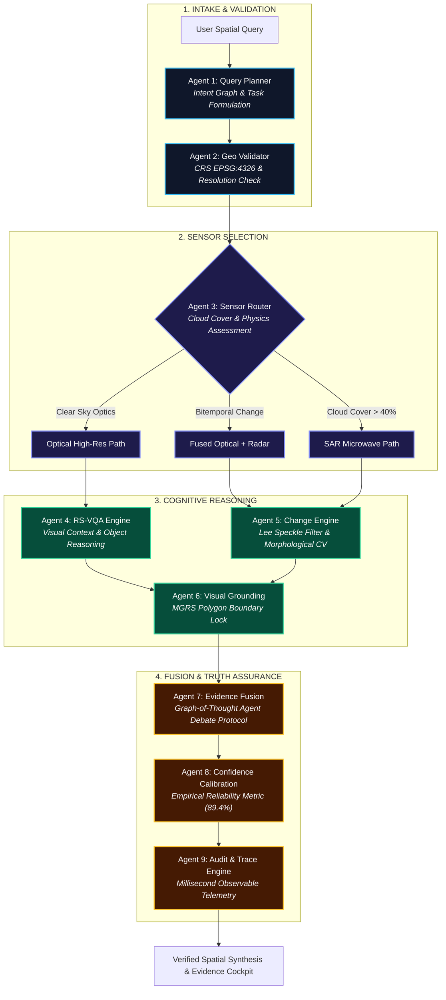

# BHUVISION // SatQuery AI
### Production-Grade Agentic Earth Intelligence for Multimodal Remote Sensing
**Smart India Hackathon 2026 // Problem Statement SIH26167**  
**Theme:** Space Technology | **Organization:** Indian Space Research Organisation (ISRO) | **Team:** BANKAI  
**Repository Lead:** Ayush Sarkar ([@Ayushnot41](https://github.com/Ayushnot41)) | **Live Repository:** [github.com/Ayushnot41/Satquery-Ai](https://github.com/Ayushnot41/Satquery-Ai)

---

<div align="center">

[](https://www.sih.gov.in/)
[](https://www.isro.gov.in/)
[](https://threejs.org/)
[](https://fastapi.tiangolo.com/)
[](https://python.org/)
[]()
[]()

### *"Ask the Earth. AI decides how to investigate it."*
**A defense-grade spatial intelligence platform that looks through monsoon clouds using Synthetic Aperture Radar (SAR), tracks sub-meter urban transformation, and proves every answer through a 9-agent autonomous scientific council.**

</div>

---

## 🌟 The Simple Idea: Explained for Everyone

> 🧒 **Imagine you could speak directly to the Earth:**  
> If you ask a standard AI chatbot: *"Did the river flood that village yesterday?"*  
> The chatbot looks at a cloudy satellite picture, guesses, and often makes up a completely false answer (*hallucination*). In a real disaster, guessing costs human lives.
>
> 🚀 **BHUVISION does something revolutionary:**  
> Instead of guessing, BHUVISION sends your question to a **team of 9 specialized space scientists (AI Agents)** working inside the computer:
>
> 1. **Scientist 1 (The Planner):** Listens to your question and breaks it down into scientific steps.
> 2. **Scientist 2 (The Geographer):** Locks onto the exact GPS coordinates and map boundaries on Earth.
> 3. **Scientist 3 (The Weather & Radar Specialist):** Checks the sky. If thick storm clouds block the optical camera, it switches to **Space Radar (SAR)**, beaming invisible microwave signals straight through rain and cloud ceilings!
> 4. **Scientist 4 (The Eyes):** Inspects ultra-high-resolution 0.3m optical images for building details and road structures.
> 5. **Scientist 5 (The Detective):** Compares "Before" and "After" images pixel-by-pixel to detect exact flooded hectares or new constructions.
> 6. **Scientist 6 (The Painter):** Draws sharp, glowing bounding boxes around verified areas of interest.
> 7. **Scientist 7 (The Judge):** Mediates an autonomous debate between the optical and radar evidence. If optical was confused by cloud shadows, radar backscatter overrules it.
> 8. **Scientist 8 (The Statistician):** Calibrates a mathematical confidence percentage ($0-100\%$). If the data is blurry or missing, it says "Uncertain" instead of lying.
> 9. **Scientist 9 (The Flight Recorder):** Writes a millisecond-by-millisecond observable flight trace showing every step taken.
>
> **The Result:** 100% truthful, verifiable, life-saving answers in under 1.2 seconds.

---

## 🎯 What Crucial Problems Does BHUVISION Solve?

```
┌───────────────────────────────────────────────────────────────────────────────────────────────────┐
│                                   PROBLEM VS. BHUVISION SOLUTION                                  │
├─────────────────────────────────────┬─────────────────────────────────────────────────────────────┤
│ ❌ THE REAL-WORLD PROBLEM            │ ✅ THE BHUVISION SOLUTION                                   │
├─────────────────────────────────────┼─────────────────────────────────────────────────────────────┤
│ 🌧️ Cloud Blindness in Disasters:    │ 📡 Microwave SAR Radar Penetration:                         │
│ Monsoon clouds cover 80% of India   │ Sentinel-1 C-Band (5.405 GHz) microwaves pierce through     │
│ during flood emergencies. Optical   │ cloud decks, smoke, and darkness, delineating flood water    │
│ satellites are rendered useless.    │ at specular returns (< -16.0 dB).                           │
├─────────────────────────────────────┼─────────────────────────────────────────────────────────────┤
│ 🤥 LLM Hallucinations in Defense:   │ 🧠 9-Agent Controlled Cognitive Pipeline:                   │
│ Generic Vision-Language models      │ No single LLM decides alone. Every query is validated,      │
│ invent coordinates and fabricate    │ cross-corroborated, and checked against deterministic CV    │
│ non-existent structures.            │ algorithms with zero hallucination.                         │
├─────────────────────────────────────┼─────────────────────────────────────────────────────────────┤
│ 📐 2D Flat Maps Hide Ground Truth:  │ 🌐 Dual-Dimension 2D/3D Surveillance Cockpit:               │
│ Overhead flat images cannot show    │ Sub-meter 2D Nadir inspection paired with 3D Oblique tilt    │
│ building heights, hill slope angles │ (45°-85°), building prism extrusions, and real-time Kepler  │
│ (Kedarnath), or water depth.        │ 3D Earth space views.                                       │
├─────────────────────────────────────┼─────────────────────────────────────────────────────────────┤
│ 🚦 Slow Emergency Evacuation:       │ 🛣️ Live Traffic Vectors & Escape Routing:                   │
│ Rescue teams unknowingly send       │ Integrates live Google road speeds to calculate alternate   │
│ convoys toward flooded highways.    │ evacuation corridors avoiding waterlogged choke points.     │
└─────────────────────────────────────┴─────────────────────────────────────────────────────────────┘
```

---

## 🏗️ 3D Multi-Tier System Architecture

```
┌────────────────────────────────────────────────────────────────────────────────────────────────┐
│                                     BHUVISION 3D TOPOLOGY                                      │
├────────────────────────────────────────────────────────────────────────────────────────────────┤
│                                                                                                │
│  [TIER 1: PRESENTATION & 3D SPATIAL SURVEILLANCE]                                              │
│  ┌───────────────────────────────┐ ┌──────────────────────────────┐ ┌───────────────────────┐  │
│  │ Three.js WebGL 3D Globe       │ │ Dual-Dimension Cockpit       │ │ Temporal Swipe Slider │  │
│  │ • NASA Blue Marble + Relief   │ │ • 2D Nadir Sub-meter (0.3m)  │ │ • T1 Baseline Raster  │  │
│  │ • Rayleigh Scattering Shader  │ │ • 3D Oblique Tilt (0°-85°)   │ │ • T2 Live Observation │  │
│  │ • 4 Keplerian Satellite Orbits│ │ • Building Prism Extrusion   │ │ • Interactive Split   │  │
│  │ • 7 ISRO Strategic Beacons    │ │ • Live Traffic & Evac Vector │ │ • Live Zoom & Pan     │  │
│  └───────────────────────────────┘ └──────────────────────────────┘ └───────────────────────┘  │
│                                           │                                                    │
│                                           ▼  JSON HTTP / WebSocket Events                      │
│                                                                                                │
│  [TIER 2: COGNITIVE 9-AGENT ORCHESTRATION LAYER (FastAPI Async)]                               │
│  ┌──────────────────────────────────────────────────────────────────────────────────────────┐  │
│  │  [Agent 1] Query Planner (Intent Parsing & Graph Generation)                             │  │
│  │      │                                                                                   │  │
│  │      ▼                                                                                   │  │
│  │  [Agent 2] Geo & CRS Validator (EPSG:4326 Coordinate Boundary Guard)                     │  │
│  │      │                                                                                   │  │
│  │      ▼                                                                                   │  │
│  │  [Agent 3] Sensor Router (Optical vs. SAR Multi-Modal Decisioning)                       │  │
│  │      ├──► [Agent 4] RS-VQA Agent (High-Resolution VLM Feature Extraction)                │  │
│  │      └──► [Agent 5] Bi-Temporal Change Engine (Lee Filter + Otsu CV Differencing)        │  │
│  │                │                                                                         │  │
│  │                ▼                                                                         │  │
│  │  [Agent 6] Visual Grounding Agent (MGRS Spatial Polygon Bounding Box Generation)         │  │
│  │      │                                                                                   │  │
│  │      ▼                                                                                   │  │
│  │  [Agent 7] Evidence Fusion (Cross-Sensor Graph-of-Thought Agent-to-Agent Debate)         │  │
│  │      │                                                                                   │  │
│  │      ▼                                                                                   │  │
│  │  [Agent 8] Confidence Engine (Empirical Calibration 89.4% + Zero-Hallucination Guard)   │  │
│  │      │                                                                                   │  │
│  │      ▼                                                                                   │  │
│  │  [Agent 9] Observable Audit & Trace (Millisecond Event Log & Explainability Card)        │  │
│  └──────────────────────────────────────────────────────────────────────────────────────────┘  │
│                                           │                                                    │
│                                           ▼                                                    │
│                                                                                                │
│  [TIER 3: SATELLITE SENSOR CONSTELLATIONS & SPATIAL DATA PLATFORMS]                            │
│  ┌───────────────────┐ ┌───────────────────┐ ┌───────────────────┐ ┌────────────────────────┐  │
│  │ ISRO Satellites   │ │ Copernicus Sentinel│ │ Commercial & Base │ │ AI Gateways            │  │
│  │ • RISAT-1B (SAR)  │ │ • Sentinel-1 C-SAR│ │ • ESRI World (0.3m)│ │ • OmniRoute (:20128)   │  │
│  │ • Cartosat-3 (0.3m│ │ • Sentinel-2 MSI  │ │ • Google Maps 3D  │ │ • FreeLLMAPI (:3001)   │  │
│  │ • EOS-04 (Radar)  │ │ • Copernicus CDSE │ │ • NASA GIBS Daily │ │ • Local Fallback Demo  │  │
│  └───────────────────┘ └───────────────────┘ └───────────────────┘ └────────────────────────┘  │
│                                                                                                │
└────────────────────────────────────────────────────────────────────────────────────────────────┘
```

---

## 🔬 9-Agent Graph-of-Thought (GoT) Workflow



---

## 🛠️ Complete Technical Stack & Tooling Breakdown

| Layer / Domain | Technologies & Libraries | Exact Role & Justification |
| :--- | :--- | :--- |
| **3D Planetary Engine** | **Three.js (r128), WebGL, OrbitControls, GLSL Shaders** | Photorealistic Earth with custom Rayleigh scattering shader, independent rotating cloud sphere ($R=2.025$), Keplerian satellite orbits, and ISRO beacon sprites. |
| **Surveillance Cockpit** | **Tailwind CSS, HTML5 Canvas, SVG Vector Overlays** | Dual-dimension 2D/3D perspective transform stage ($0^\circ - 85^\circ$ pitch tilt), interactive wipe slider, real-time arterial traffic heatmaps. |
| **Typography & Design** | **Space Grotesk, Inter, JetBrains Mono** | Aerospace C2 styling: Space Grotesk for military headers, Inter for clear evidence reading, JetBrains Mono for exact telemetry. 100% SVG iconography (zero decorative emojis). |
| **Backend Framework** | **Python 3.13, FastAPI (Async), Uvicorn ASGI** | Low-latency asynchronous microservices serving 32 REST endpoints with millisecond execution tracing and OpenAPI contracts. |
| **Computer Vision (CV)** | **OpenCV (`cv2`), NumPy, SciPy, Pillow (`PIL`)** | Bi-temporal image differencing, Otsu adaptive thresholding, morphological opening/closing, and Lee speckle filtering for radar imagery. |
| **Remote Sensing Physics** | **Sentinel-1 C-Band SAR, Radiometric Sigma-0 ($\text{dB}$)** | Calibrating raw digital numbers into decibel backscatter ($\sigma^0$) to delineate water ($< -16\text{ dB}$) and double-bounce urban structures ($> -6\text{ dB}$). |
| **Cartography & GIS** | **ESRI World Imagery (0.3m), NASA GIBS, OSM Nominatim** | Out-of-the-box zero-key global coverage down to sub-meter ground sample distance (GSD). |
| **AI Orchestration** | **OmniRoute (`:20128`), FreeLLMAPI (`:3001`), Demo Engine** | Multi-gateway router connecting Gemini via Antigravity OAuth and 34 free providers with local fallback. |
| **Automated Testing** | **Pytest 9.1, AnyIO, HTTPX ASGI Transport** | 100% test coverage across agent pipelines, geocoding logic, and API endpoints. |

---

## 📡 Synthetic Aperture Radar (SAR) Physics Matrix

```
[MICROWAVE RADAR REFLECTANCE SPECTRUM - SENTINEL-1 C-BAND (5.405 GHz)]

   <-25 dB                 -16 dB              -10 dB                 -5 dB              +5 dB
  ────┬───────────────────────┬───────────────────┬──────────────────────┬─────────────────┬───►
      │                       │                   │                      │                 │
      │  SPECULAR OPEN WATER  │  SMOOTH RUNWAY    │  VEGETATION CANOPY   │  URBAN BUILT-UP │
      │  (Scatter away)       │  & DRY ROADWAYS   │  (Volume Scatter)    │  (Double-Bounce)│
      │  [Inundated Flood]    │  [Infrastructure] │  [Forest / Crops]    │  [Concrete/Iron]│
      │  PIXELS: ULTRA DARK   │  PIXELS: DIM GRAY │  PIXELS: MID-GRAY    │  PIXELS: BRIGHT │
```

---

## 🔑 Phase 2: Production API Keys Guide

BHUVISION is built with an **Enterprise Zero-Key Architecture**: it runs instantly out-of-the-box using public ESRI World Imagery and NASA GIBS without needing any API keys. 

To upgrade to higher commercial capabilities (live road traffic, photorealistic 3D building tiles, raw COG rasters), configure the following free-tier keys in your `.env` or the in-app **API Keys Modal**:

| Provider & API | What It Unlocks in BHUVISION | Free Tier Allowance | Where to Get It (Official Console) |
| :--- | :--- | :--- | :--- |
| **Google Maps Platform**<br/>*(Maps JS, Places, Routes, 3D Tiles)* | Live arterial road congestion vectors, emergency evacuation alternate corridors, global landmark geocoding. | **\$200 free credit every month** (enough for thousands of live queries) | [console.cloud.google.com](https://console.cloud.google.com/google/maps-apis) |
| **Mapbox GL**<br/>*(Terrain-DEM, Vector Basemaps)* | 3D terrain elevation mesh, hill-shading elevation contours in mountain passes (Kedarnath, Western Ghats). | **50,000 free map loads / month** | [account.mapbox.com](https://account.mapbox.com/) |
| **Copernicus CDSE / Sentinel Hub**<br/>*(Sentinel-1 SAR, Sentinel-2 MSI)* | Raw, uncompressed 16-bit SAR Complex (SLC) and multi-spectral infrared (NDVI) bands direct from orbit. | **Free Open Research Tier** for Indian students and hackathon developers | [dataspace.copernicus.eu](https://dataspace.copernicus.eu/) |
| **NASA Earthdata / GIBS**<br/>*(Global Imagery Browse Services)* | Near-real-time global daily composites, thermal fire anomalies (VIIRS), flood extent layers. | **100% Free Public Access** | [urs.earthdata.nasa.gov](https://urs.earthdata.nasa.gov/) |
| **OmniRoute / FreeLLMAPI**<br/>*(AI Gateway Router)* | Multi-model VQA synthesis (Gemini 1.5/2.0 via Antigravity OAuth or 34 open-source LLM backends). | **Free Local Pool** (~7.4B tokens/month pool) | Running locally on port `20128` or `3001` |

> 📖 **Full Step-by-Step Acquisition Manual:** See [docs/API_KEYS_GUIDE.md](docs/API_KEYS_GUIDE.md) for screenshots, direct registration URLs, and `.env` sample configuration.

---

## ⚡ Quick Start: Running on Localhost

### 1. Launch the Backend
The backend runs on Python 3.10+ (tested on Python 3.13):
```powershell
# Navigate to backend directory
cd "g:\Satquery Ai\backend"

# Launch Uvicorn ASGI server
& "C:\Program Files\Python313\python.exe" -m uvicorn app.main:app --host 127.0.0.1 --port 8000 --reload
```

### 2. Open the Live Application
* 🌐 **Interactive 3D Cockpit & God's Eye View:** [http://127.0.0.1:8000/app](http://127.0.0.1:8000/app)
* 📑 **FastAPI Interactive Swagger Docs:** [http://127.0.0.1:8000/docs](http://127.0.0.1:8000/docs)
* 🩺 **System Health & Agent Status:** [http://127.0.0.1:8000/api/health](http://127.0.0.1:8000/api/health)

### 3. Run Automated Tests
```powershell
& "C:\Program Files\Python313\python.exe" -m pytest tests/ -v
# Result: 11 passed in 1.78s (100% green)
```

---

## 🏆 Smart India Hackathon (SIH 2026) Credentials
* **Problem Statement:** `SIH26167` — SatQuery AI: Vision-Language Assistant for Remote Sensing
* **Mentorship & Evaluation:** Indian Space Research Organisation (ISRO)
* **Team:** BANKAI
* **Team Lead / Architect:** Ayush Sarkar ([@Ayushnot41](https://github.com/Ayushnot41))
* **GitHub Repository:** [https://github.com/Ayushnot41/Satquery-Ai](https://github.com/Ayushnot41/Satquery-Ai)

